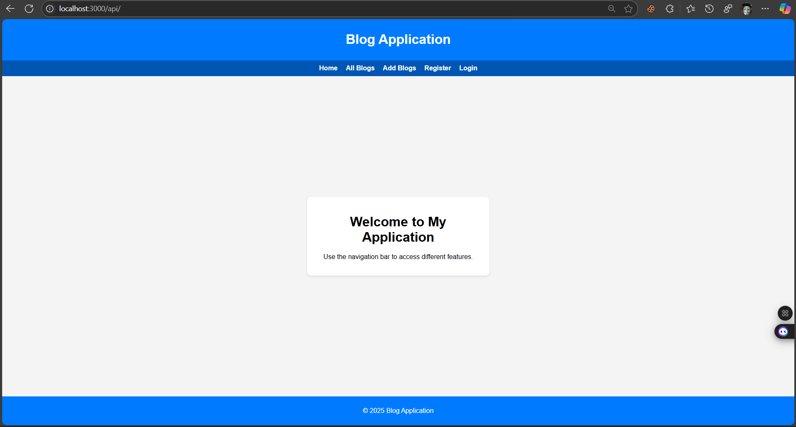
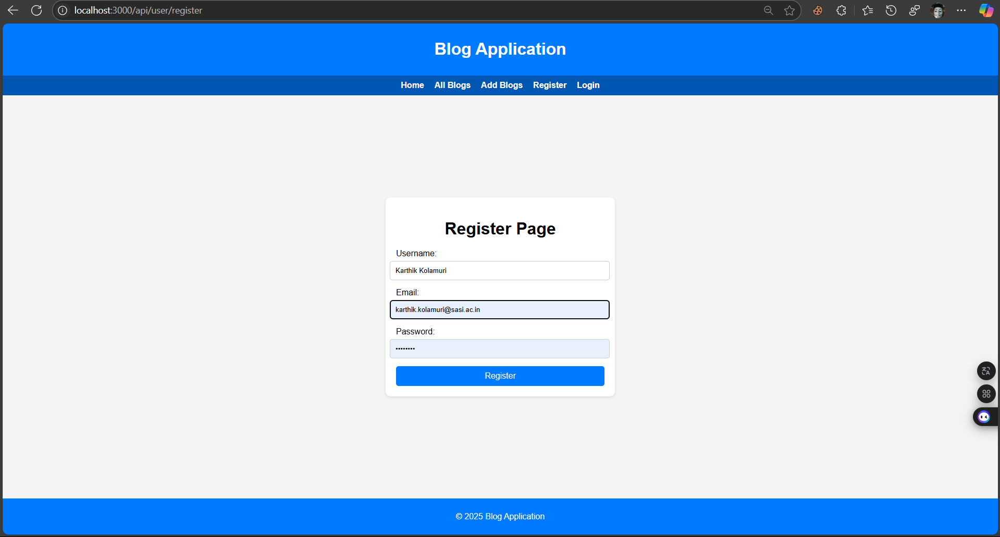
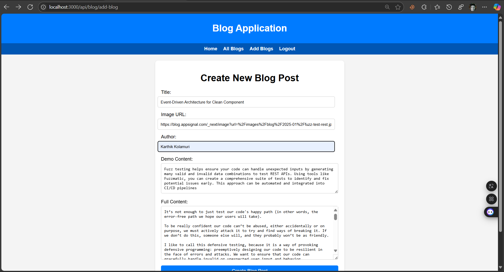
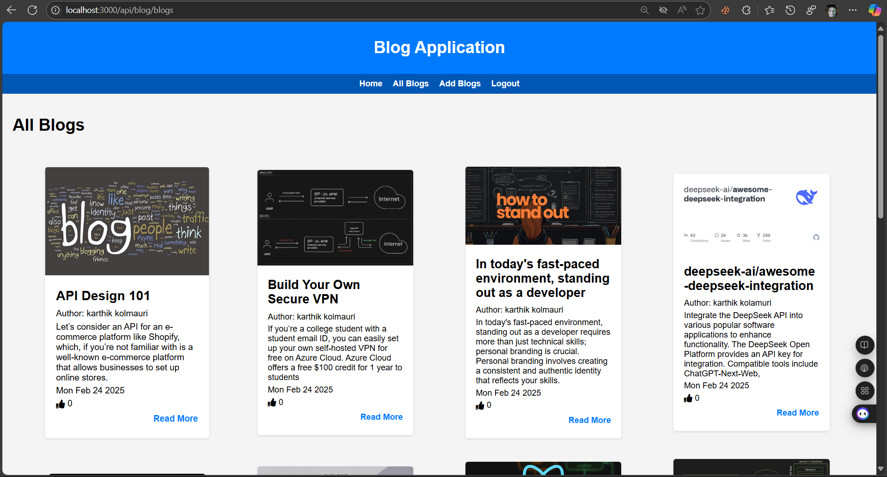
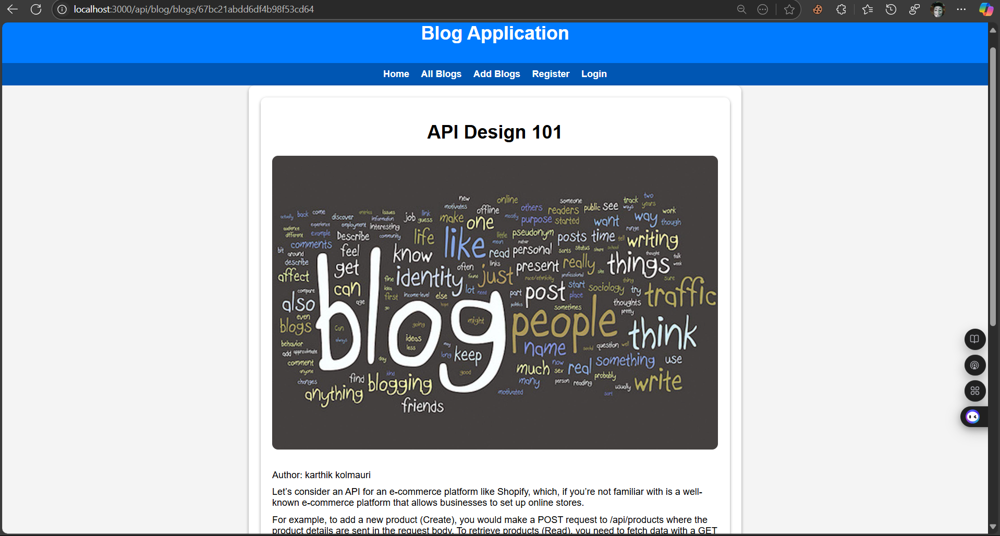
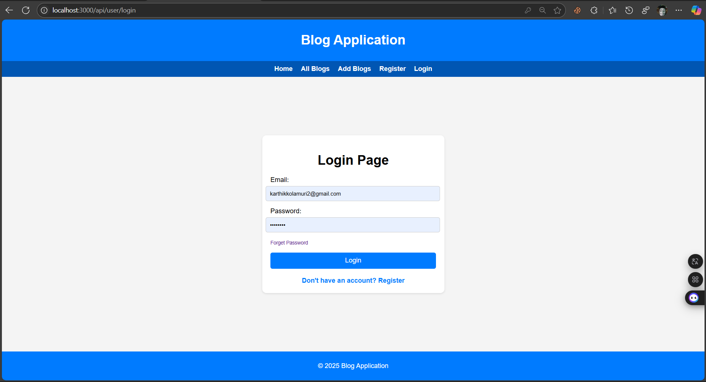
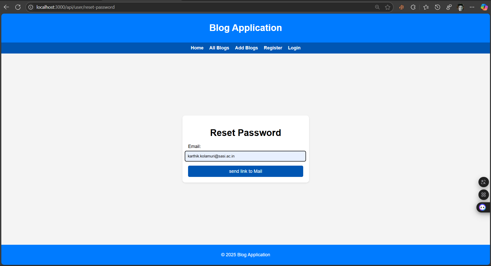
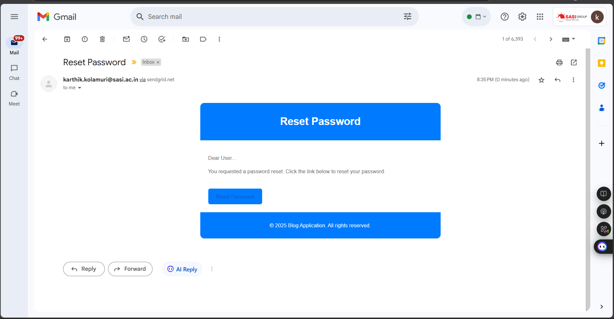
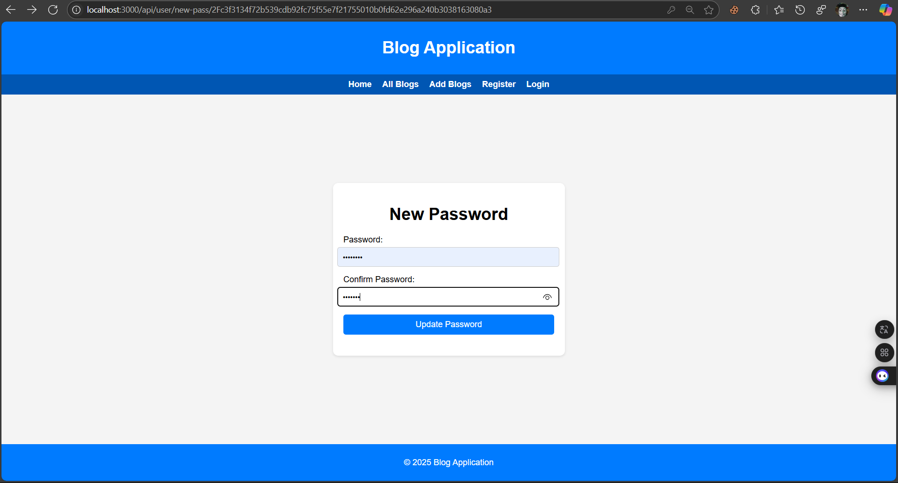

# 📝 Blogs Application

Welcome to the **Blogs Application** – a full-featured blogging platform where users can register, log in, create, view, and like blog posts.

Built with **Node.js**, **Express**, **MongoDB**, **NodeMailer**, **SendGrid** and **Pug** templating.

---

## 🚀 Features

- 🔐 **User Authentication**: Register, log in, and log out securely
- 📝 **Blog Management**: Create, view, and like blog posts
- 📱 **Responsive Design**: Works well on all devices
- 💬 **Interactive UI**: Designed to be user-friendly and intuitive
- 📧 **Email Verification**: Sends a verification email after account registration

---

## 📦 Table of Contents

- [Installation](#installation)
- [Usage](#usage)
- [Project Structure](#project-structure)
- [Routes](#routes)
- [Screenshots](#screenshots)
- [License](#license)

---

## 🛠 Installation

1. **Clone the repository**

```bash
git clone https://github.com/karthik-kolamuri/Blogs.git
cd Blogs/Blogs
```

2. **Install dependencies**

```bash
npm install
```

3. **Configure environment variables**

Create a `.env` file in the root directory with:

```env
MONGO_URI=your_mongodb_connection_string
SESSION_SECRET=your_session_secret
SENDGRID_API_KEY=your_API_key
```

4. **Start the application**

```bash
npm run dev
```

---

## 📋 Usage

- **Register**: `/api/user/register`
- **Login**: `/api/user/login`
- **Create Blog**: `/api/blog/add-blog`
- **View Blogs**: `/api/blog/blogs`
- **Like Blog**: Use the like button on any blog post

---

## 🧩 Project Structure

```
├── controllers
│   ├── blogController.js
│   └── loginController.js
├── models
│   ├── Blog.js
│   └── userLogin.js
├── routes
│   ├── blogRoutes.js
│   └── loginRoutes.js
├── views
│   ├── blogs
│   │   ├── createBlog.pug
│   │   ├── viewBlog.pug
│   │   └── viewSingleBlog.pug
│   ├── layouts
│   │   └── index.pug
│   └── login
│       ├── login.pug
│       └── register.pug
├── .env
├── app.js
├── package.json
└── README.md
```

---

## 🔁 Routes

### 👤 User Routes

- `GET /api/user/register` – Registration page
- `POST /api/user/register` – Register a new user
- `GET /api/user/login` – Login page
- `POST /api/user/login` – Log in user
- `GET /api/user/logout` – Log out
- `GET /api/user/reset-password` – Reset-password page
- `POST /api/user/reset-password` – Reset-password 
- `GET /api/user/new-pass/:token` – New-password page
- `POST /api/user/new-pass/:token` – New-password 

 

### 📝 Blog Routes

- `GET /api/blog/add-blog` – Create blog page
- `POST /api/blog/add-blog` – Submit a blog
- `GET /api/blog/blogs` – View all blogs
- `GET /api/blog/blogs/:id` – View specific blog
- `PUT /api/blog/blogs/:id` – Like a blog post


---

## 🖼️ Screenshots

| Page                        | Screenshot |
|-----------------------------|------------|
| **🏠 Home Page**             |  |
| **📝 Register Page**         |  |
| **🔐 Login Page**            |  |
| **🆕 Create Blog Page**      |  |
| **📄 View Blogs Page**       |  |
| **📑 View Single Blog Page** |  |
| **🔐 Logout Page**           |  |
| **🔐 Forgot Password Page**  |  |
| **📑 Email Template Page**   |  |
| **📝 Re-Enter Password Page**|  |
| **🔐 Re-Login Page**         |  |
| **📄 View Blogs Page**       |  |


---

## 📄 License

This project is licensed under the MIT License. See the [LICENSE](../LICENSE) file for details.

---

## 🙌 Thank You

Thanks for using **Blogs Application**!  
Feel free to open issues or contribute ideas 💡


📧 **Mail**: karthik.kolamuri@sasi.ac.in  
📧 **Personal Mail**: kart91801@gmail.com
👤 **Author**: Karthik Kolamuri
