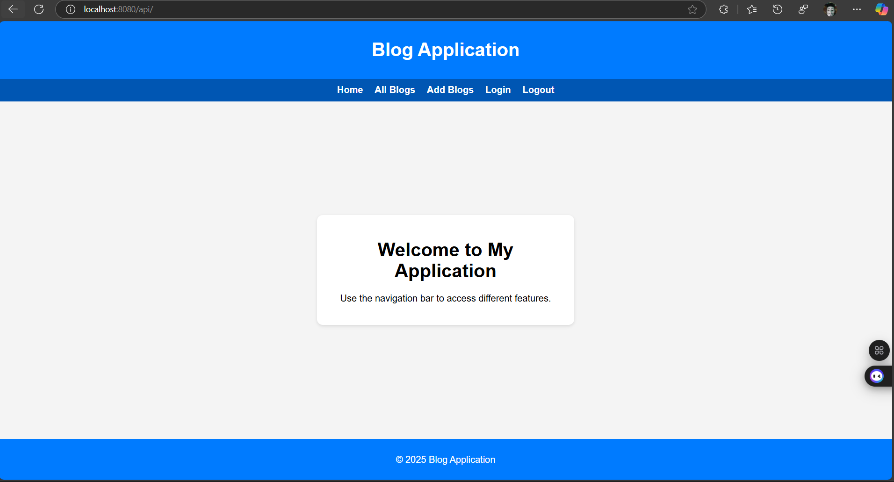
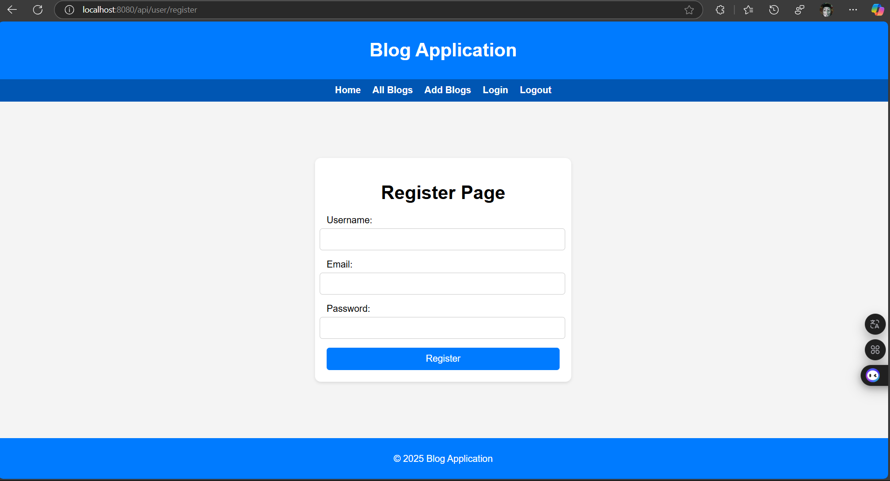
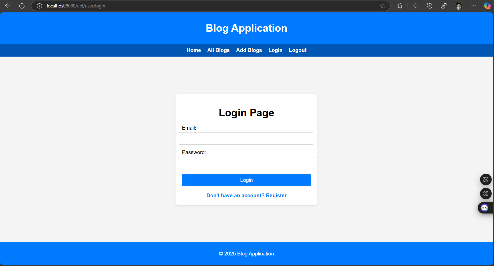
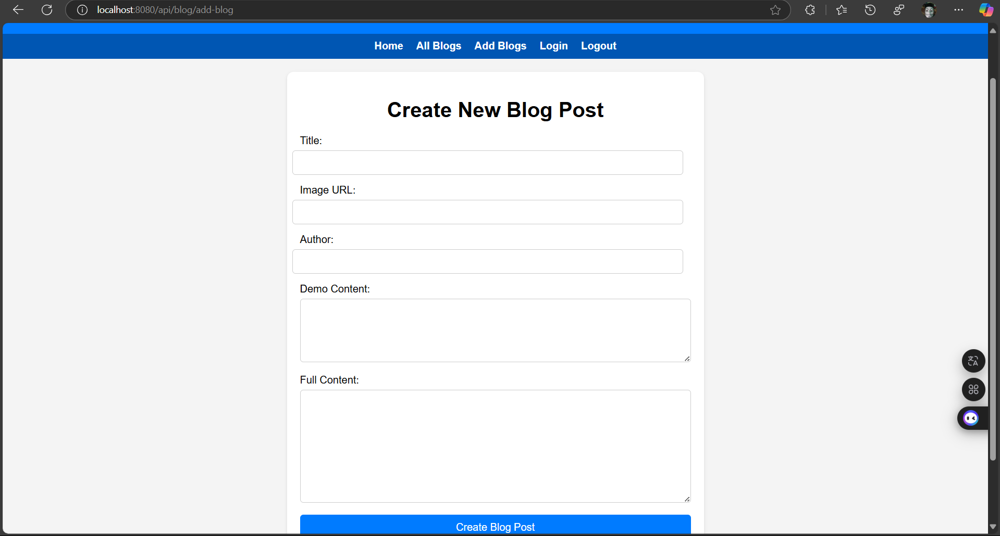
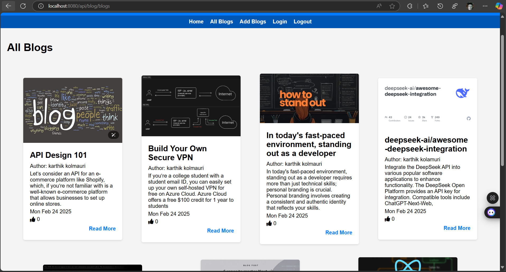
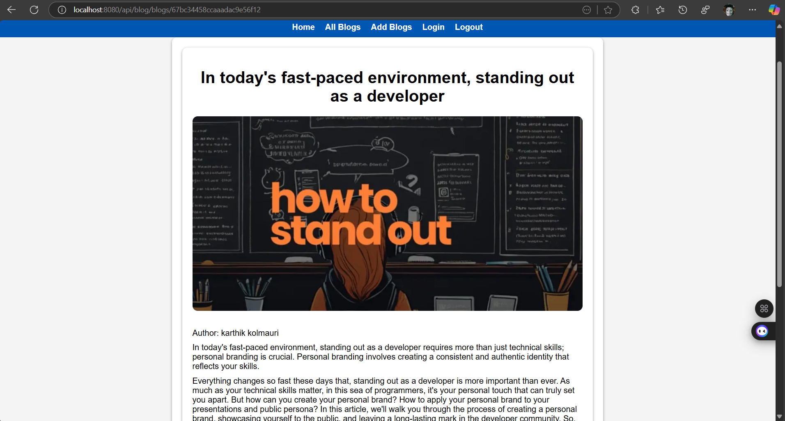

#Blogs Application
# Blog Application

Welcome to the Blog Application! This project is a full-featured blogging platform where users can register, log in, create, view, and like blog posts. The application is built using Node.js, Express, MongoDB, and Pug for templating.

## Features

- **User Authentication**: Users can register, log in, and log out.
- **Blog Management**: Users can create, view, and like blog posts.
- **Responsive Design**: The application is fully responsive and works well on all devices.
- **Interactive UI**: The UI is designed to be user-friendly and interactive.

## Table of Contents

- [Installation](#installation)
- [Usage](#usage)
- [Project Structure](#project-structure)
- [Routes](#routes)
- [Screenshots](#screenshots)
- [License](#license)

## Installation

1. **Clone the repository**:
    ```bash
    git clone https://github.com/karthik-kolamuri/Blogs.git
    cd Blogs
    ```

2. **Install dependencies**:
    ```bash
    npm install
    ```

3. **Set up environment variables**:
    Create a `.env` file in the root directory and add the following:
    ```env
    MONGO_URI=your_mongodb_connection_string
    SESSION_SECRET=your_session_secret
    ```

4. **Start the application**:
    ```bash
    npm start
    ```

## Usage

1. **Register**: Navigate to `/api/user/register` to create a new account.
2. **Login**: Navigate to `/api/user/login` to log in to your account.
3. **Create Blog**: Navigate to `/api/blog/add-blog` to create a new blog post.
4. **View Blogs**: Navigate to `/api/blog/blogs` to view all blog posts.
5. **Like Blog**: Click the like button on any blog post to like it.

## Project Structure
 ├── controllers 
 │ ├── blogController.js 
 │ └── loginController.js 
 ├── models │ 
 ├── Blog.js 
 │ └── userLogin.js 
 ├── routes 
 │ ├── blogRoutes.js 
 │ └── loginRoutes.js 
 ├── views 
 │ ├── blogs 
 │ │ ├── createBlog.pug 
 │ │ ├── viewBlog.pug 
 │ │ └── viewSingleBlog.pug 
 │ ├── layouts 
 │ │ └── index.pug 
 │ └── login 
 │ ├── login.pug 
 │ └── register.pug 
 ├── .env 
 ├── app.js 
 ├── package.json 
 └── README.md


## Routes

### User Routes

- **GET** `/api/user/register` - Render the registration page.
- **POST** `/api/user/register` - Register a new user.
- **GET** `/api/user/login` - Render the login page.
- **POST** `/api/user/login` - Log in a user.
- **GET** `/api/user/logout` - Log out the current user.

### Blog Routes

- **GET** `/api/blog/add-blog` - Render the create blog page.
- **POST** `/api/blog/add-blog` - Create a new blog post.
- **GET** `/api/blog/blogs` - View all blog posts.
- **GET** `/api/blog/blogs/:id` - View a single blog post.
- **POST** `/api/blog/like/:id` - Like a blog post.

## Screenshots

### Home Page


### Register Page


### Login Page


### Create Blog Page


### View Blogs Page


### View Single Blog Page


## License

This project is licensed under the MIT License. See the LICENSE file for details.

---

Thank you for using the Blog Application! If you have any questions or feedback, feel free to open an issue or contact the project maintainer.